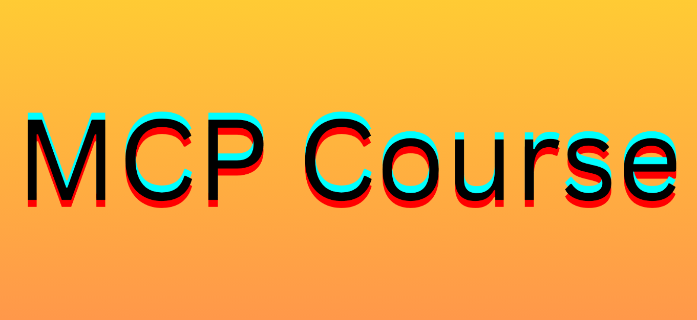

# MCP-Deep-Dive-Series

📘 MCP-Deep-Dive-Series

MCP-Deep-Dive-Series is a monthly curated collection of resources dedicated to the Model Context Protocol (MCP) ecosystem. This repository aggregates the latest developments, tutorials, tools, and discussions from various platforms, including GitHub, YouTube, blogs, and community forums, providing a centralized hub for enthusiasts and professionals alike.

🧠 What is MCP?

The Model Context Protocol (MCP) is an open standard introduced by Anthropic in late 2024. It facilitates seamless communication between AI assistants and external tools or data sources, enabling structured, secure, and extensible interactions. MCP supports various transport protocols like stdio and HTTP with Server-Sent Events (SSE), and it's designed to be model-agnostic, allowing integration across different AI systems.

📌  Highlights JUN2025

[The Model Context Protocol (MCP)](https://www.youtube.com/watch?v=CQywdSdi5iA)

```
Theo Chu, David Soria Parra and Alex Albert from Anthropic dive into the Model Context Protocol (MCP),
the standard that's changing how AI applications connect with external data and tools.
```

[The last MCP server you'll ever need](https://www.youtube.com/watch?v=_821hYFZyCo)

```
Docker just solved MCP servers' biggest problems - from chaotic setup to security nightmares.
The MCP Toolkit extension transforms how we discover, install, and secure Model Context Protocol servers
with centralized management and containerized isolation.
```

📌  Highlights MAY2025

[MCP Servers in VS Code](https://www.youtube.com/watch?v=Coot4TFTkN4)

```
In this clip from Agent Mode Day, James Montemagno demos MCP Servers in VS Code!
Docker is used to run mcp servers
Examples taken from : https://github.com/modelcontextprotocol/servers
```
[Your API is not an MCP | DEMFP786](https://www.youtube.com/watch?v=eeOANluSqAE)

```
A lot of companies have jumped on the MCP bandwagon by quickly auto-generating their MCP servers from their APIs.
This isn’t right as MCP servers are made to be consumed by LLMs and not by humans.
Join us to better understand why MCPs have to be thought of carefully.
Experience examples of tools that make sense for agents but not for humans, and why you
should be careful designing your MCP set of tools and resources.
```

[HuggingFace Model Context Protocol (MCP) Course](https://huggingface.co/learn/mcp-course/unit0/introduction)



```
The "Introduction" unit of Hugging Face's Model Context Protocol (MCP) Course serves as an onboarding guide
for learners interested in integrating AI models with external tools and data sources. This free course is
designed to take participants from foundational knowledge to practical application of MCP.
```

[MCP vs API: Simplifying AI Agent Integration with External Data](https://www.youtube.com/watch?v=7j1t3UZA1TY)

```
Which revolutionizes AI integration, MCP or API? According to Martin Keen, the Model Context Protocol (MCP)
transforms AI agents by making it possible for tool execution, dynamic discovery, and smooth external data retrieval.
Find out how MCP surpasses conventional APIs and streamlines LLM procedures.
```

[MCP Complete Tutorial - Connect Local AI Agent (Ollama) to Tools with MCP Server and Client](https://www.youtube.com/watch?v=aiH79Q-LGjY)

```
Learn how to implement the Model Context Protocol (MCP) to connect your LLMs (like local Ollama models)
to external systems. We'll build an MCP server, client, and a Streamlit UI for an AI-powered todo list manager.
```
[Top 10 MCP Use Cases - Using Claude & Model Context Protocol](https://www.youtube.com/watch?v=lzbbPBLPtdY)

```
In this video there are ten examples of how one can start using MCP right now to perform
different tasks directly in Claude.
```

[Does GitHub's New MCP Server KILL Git Commands? (w/ Cursor)](https://www.youtube.com/watch?v=3ivTdBgzMMI)

```
The new GitHub MCP (model context protocol) server was recently released.
In this video traditional git commands are compared with the GitHub CLI. 
```


📂 MCP Deep Dive Series

https://www.youtube.com/playlist?list=PLQGgwSxhTOu9qdy_63B4bg6nBlftkWAdW

